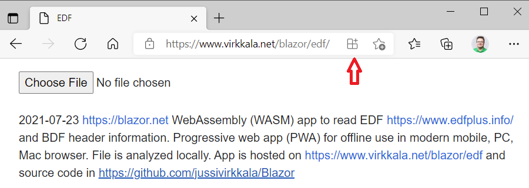
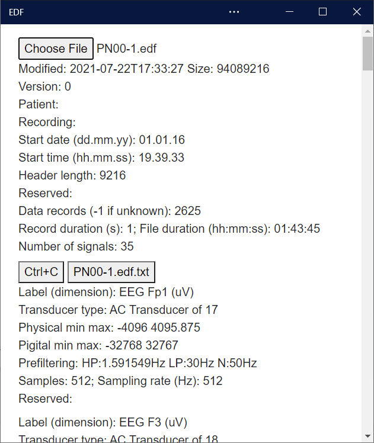

# EDF

Blazor https://blazor.net  WebAssembly (WASM) app to read EDF https://www.edfplus.info/ header information. Progressive web app (PWA) for offline use in any mobile, PC, Mac browser. File is analyzed locally. It is hosted on https://www.virkkala.net/blazor/edf and source code in https://github.com/jussivirkkala/Blazor.


- 2021-07-19 Adding version date.
- 2021-07-18 Corrected Digital label. Max file size 5 GB and 256 channels.

Install as PWA by clicking icon in end of browser address bar.



Select EDF file e.g. from https://physionet.org/about/database/


# Code

There are minimal changes to default Blazor template in Visual Studio 2019. 



Extra navigation are commented out using `@*` in MainLayout.razor.

```
@inherits LayoutComponentBase

<div class="page">
    @*
        <div class="sidebar">
            <NavMenu />
        </div>
    *@
    <div class="main">
        @*
        <div class="top-row px-4">
            <a href="http://blazor.net" target="_blank" class="ml-md-auto">About</a>
        </div>
        *@
        <div class="content px-4">
            @Body
        </div>
    </div>
</div>
``` 
All other changes are done into Index.razor  [Index.razor](Pages/Index.razor)
```
@page "/"
@*
    Displaying EDF file header information
    @jussivirkkala
    - Support EDF+
    - Display events.
    2021-07-21 Resetting signals.
    2021-07-20 BDF, .ASCII encoding, calculate file duration, sampling rate, check version.
    2021-07-19 Path www.github.com/jussivirkkala/Blazor.
    2021-07-18 Corrected digital label. Max file size 5 GB, 256 channels.
    2021-07-17 First version.

    https://www.edfplus.info/specs/edf.html
    HEADER RECORD (we suggest to also adopt the 12 simple additional EDF+ specs)
    8 ascii : version of this data format (0)
    80 ascii : local patient identification (mind item 3 of the additional EDF+ specs)
    80 ascii : local recording identification (mind item 4 of the additional EDF+ specs)
    8 ascii : startdate of recording (dd.mm.yy) (mind item 2 of the additional EDF+ specs)
    8 ascii : starttime of recording (hh.mm.ss)
    8 ascii : number of bytes in header record
    44 ascii : reserved
    8 ascii : number of data records (-1 if unknown, obey item 10 of the additional EDF+ specs)
    8 ascii : duration of a data record, in seconds
    4 ascii : number of signals (ns) in data record
    ns * 16 ascii : ns * label (e.g. EEG Fpz-Cz or Body temp) (mind item 9 of the additional EDF+ specs)
    ns * 80 ascii : ns * transducer type (e.g. AgAgCl electrode)
    ns * 8 ascii : ns * physical dimension (e.g. uV or degreeC)
    ns * 8 ascii : ns * physical minimum (e.g. -500 or 34)
    ns * 8 ascii : ns * physical maximum (e.g. 500 or 40)
    ns * 8 ascii : ns * digital minimum (e.g. -2048)
    ns * 8 ascii : ns * digital maximum (e.g. 2047)
    ns * 80 ascii : ns * prefiltering (e.g. HP:0.1Hz LP:75Hz)
    ns * 8 ascii : ns * nr of samples in each data record
    ns * 32 ascii : ns * reserved
*@

<InputFile id="inputDefault"
           OnChange="OnFileSelection"
           accept=".edf,.rec,.bdf" />
<br>
@if (header != null)
{
<label>
    version: @header.version
    <br>patient: @header.patient
    <br>recording: @header.recording
    <br>start date (dd.mm.yy): @header.startdate
    <br>start time (hh.mm.ss): @header.starttime
    <br>header length (256+signals*256): @header.headerlength
    <br>reserved 44: @header.reserved44
    <br>data records (-1 if unknown): @header.records
    <br>record duration (s): @header.duration ; file duration (h): @(header.length.ToString("F2")) 
    <br>number of signals: @header.signals
</label>
}

@if (signals != null)
{
    @foreach (var signal in signals)
    {
        <br>
        <label>
            label (dimension): @signal.label (@signal.dimension)
            <br>transducer type: @signal.transducer
            <br>physical min max: @signal.physicalMin @signal.physicalMax
            <br>digital min max: @signal.digitalMin @signal.digitalMax
            <br>prefiltering: @signal.prefiltering
            <br>samples: @signal.samples ; sampling rate (Hz): @(signal.samplingrate.ToString("F4"))
            <br>reserved: @signal.reserved32
        </label>
    }
}
<br>
2021-07-20 <a href="https://blazor.net">https://blazor.net</a>  WebAssembly (WASM) app to read
<a href="https://www.edfplus.info/">https://www.edfplus.info/</a> and BDF  header information.
Progressive web app (PWA) for offline use in any mobile, PC, Mac browser. File is analyzed locally.
App is hosted on <a href="https://www.virkkala.net/blazor/edf">https://www.virkkala.net/blazor/edf</a> and
source code in <a href="https://github.com/jussivirkkala/Blazor">https://github.com/jussivirkkala/Blazor</a>

@code {
    const long MAXSIZE = 4294967296; // 4 GB, FAT32 limit
    private edfHeader header;
    private edfSignal[] signals;

    public class edfHeader
    {
        public string version { get; set; }
        public string patient { get; set; }
        public string recording { get; set; }
        public string startdate { get; set; }
        public string starttime { get; set; }
        public string headerlength { get; set; }
        public string reserved44 { get; set; }
        public string records { get; set; }
        public string duration { get; set; }
        public string signals { get; set; }
        public double length { get; set; }
    }

    public class edfSignal
    {
        public string label { get; set; }
        public string transducer { get; set; }
        public string dimension { get; set; }
        public string physicalMin { get; set; }
        public string physicalMax { get; set; }
        public string digitalMin { get; set; }
        public string digitalMax { get; set; }
        public string prefiltering { get; set; }
        public string samples { get; set; }
        public string reserved32 { get; set; }
        public double samplingrate { get; set; }
    }

    private async Task OnFileSelection(InputFileChangeEventArgs e)
    {
        header = new edfHeader();
        if (signals !=null) signals = null;
        IBrowserFile file = e.File;
        // Header 256 bytes
        var bytes = new byte[256 + 256 * 256]; // Max 256 channels
        int i = 0;
        await file.OpenReadStream(MAXSIZE).ReadAsync(bytes, 0, bytes.Length);
        header.version = System.Text.Encoding.ASCII.GetString(bytes, i, 8); i += 8;
        if (header.version.CompareTo("0       ") != 0)
        {
            // header.version = "Not correct EDF/BDF file";
            // return;
        }
        header.patient = System.Text.Encoding.ASCII.GetString(bytes, i, 80); i += 80;
        header.recording = System.Text.Encoding.ASCII.GetString(bytes, i, 80); i += 80;
        header.startdate = System.Text.Encoding.ASCII.GetString(bytes, i, 8); i += 8;
        header.starttime = System.Text.Encoding.ASCII.GetString(bytes, i, 8); i += 8;
        header.headerlength = System.Text.Encoding.ASCII.GetString(bytes, i, 8); i += 8;
        header.reserved44 = System.Text.Encoding.ASCII.GetString(bytes, i, 44); i += 44;
        header.records = System.Text.Encoding.ASCII.GetString(bytes, i, 8); i += 8;
        header.duration = System.Text.Encoding.ASCII.GetString(bytes, i, 8).TrimEnd(); i += 8;
        header.signals = System.Text.Encoding.ASCII.GetString(bytes, i, 4); i += 4;
        uint n = UInt32.Parse(header.signals);
        double duration = Double.Parse(header.duration); // signal record duration, usually 1 s
        uint r = UInt32.Parse(header.records);
        header.length = duration*r / 3600.0;

        signals = new edfSignal[n];
        int j;
        for (j = 0; j < n; j += 1)
        {
            signals[j] = new edfSignal();
            signals[j].label = System.Text.Encoding.ASCII.GetString(bytes, i, 16); i += 16;
        }
        for (j = 0; j < n; j += 1)
        {
            signals[j].transducer = System.Text.Encoding.ASCII.GetString(bytes, i, 80); i += 80;
        }
        for (j = 0; j < n; j += 1)
        {
            signals[j].dimension = System.Text.Encoding.ASCII.GetString(bytes, i, 8).TrimEnd(); i += 8;
        }
        for (j = 0; j < n; j += 1)
        {
            signals[j].physicalMin = System.Text.Encoding.ASCII.GetString(bytes, i, 8); i += 8;
        }
        for (j = 0; j < n; j += 1)
        {
            signals[j].physicalMax = System.Text.Encoding.ASCII.GetString(bytes, i, 8); i += 8;
        }
        for (j = 0; j < n; j += 1)
        {
            signals[j].digitalMin = System.Text.Encoding.ASCII.GetString(bytes, i, 8); i += 8;
        }
        for (j = 0; j < n; j += 1)
        {
            signals[j].digitalMax = System.Text.Encoding.ASCII.GetString(bytes, i, 8); i += 8;
        }
        for (j = 0; j < n; j += 1)
        {
            signals[j].prefiltering = System.Text.Encoding.ASCII.GetString(bytes, i, 80); i += 80;
        }
        for (j = 0; j < n; j += 1)
        {
            signals[j].samples = System.Text.Encoding.ASCII.GetString(bytes, i, 8).TrimEnd(); i += 8;
            uint s = UInt16.Parse(signals[j].samples);
            signals[j].samplingrate = s / duration;
        }
        for (j = 0; j < n; j += 1)
        {
            signals[j].reserved32 = System.Text.Encoding.ASCII.GetString(bytes, i, 32); i += 32;
        }
    }

}

@* End *@

```

In wwwroot index.html has changes for hosting. In local testing use /.
```
<base href="/blazor/edf/" />
```
and in service-worker.published.js for PWA. See https://docs.microsoft.com/en-us/aspnet/core/blazor/host-and-deploy/webassembly?view=aspnetcore-5.0#disable-integrity-checking-for-pwas.
```
.map(asset => new Request(asset.url));
```

