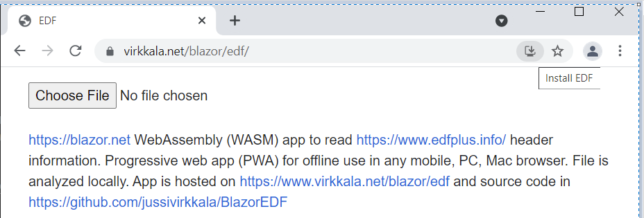
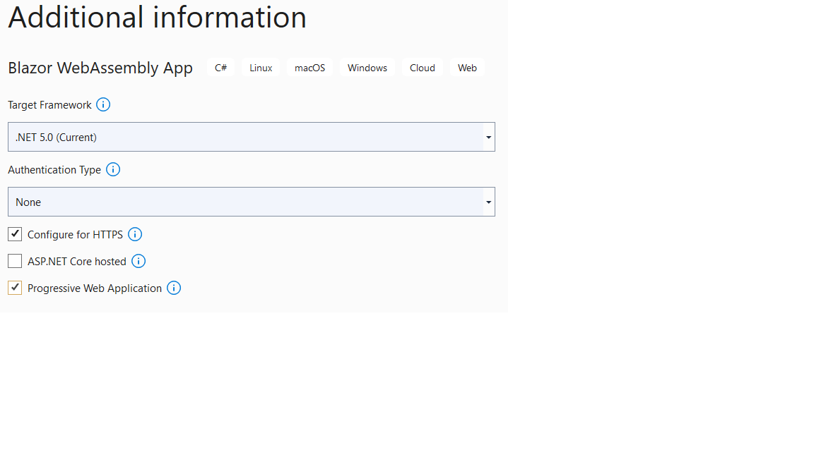

# EDF

2023-12-09 .NET8 Blazor https://blazor.net  WebAssembly (WASM) app to read EDF https://www.edfplus.info/ header information. Progressive web app (PWA) for offline use in any mobile, PC, Mac browser. File is analyzed locally. It is hosted on https://jussivirkkala.github.io/Blazor-EDF/ and source code in https://github.com/jussivirkkala/Blazor-EDF. 

Use Ctrl+F5 to force refresh. Install as PWA by clicking icon in end of browser address bar.



Select EDF file e.g. from https://physionet.org/about/database/. Examples https://physionet.org/content/siena-scalp-eeg/1.0.0/PN00/PN00-1.edf.  



You can copy header to clipboard or download as ascii [PN00-1.edf.txt](PN00-1.edf.txt)

# Code

There are minimal changes to default Blazor empty template. You can use .NET8 SDK https://dotnet.microsoft.com/ to run app: 

```
dotnet watch run
```
Code and UI is in [Pages/Home.razor](Pages/Home.razor)


Additional scripts saveFiles.js. [wwwroot/index.html](wwwroot/index.html) has changes for UI and hosting. When hosting use correct folder e.g. ```<base href="/blazor/edf/" />``` in publish\wwwroot\index.html.
```
<style>
    body {
        overscroll-behavior: none;
    }

</style>
...
 <meta name="viewport" content="width=device-width, initial-scale=1.0, maximum-scale=1.0, user-scalable=no, minimum-scale=1, height=device-height" />
...
<base href="/" />
...
<script src="saveFile.js"></script>
<script src="_framework/blazor.webassembly.js"></script>
```
and in service-worker.published.js for PWA. See https://docs.microsoft.com/en-us/aspnet/core/blazor/host-and-deploy/webassembly?view=aspnetcore-6.0#disable-integrity-checking-for-pwas.

```
.map(asset => new Request(asset.url, { integrity: asset.hash, cache: 'no-cache' }));
->
.map(asset => new Request(asset.url));
```

To publish app: 

```
dotnet publish -c Release
```
Copy files from bin\Release\net8.0\publish\wwwroot to 

