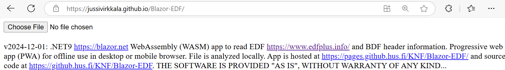
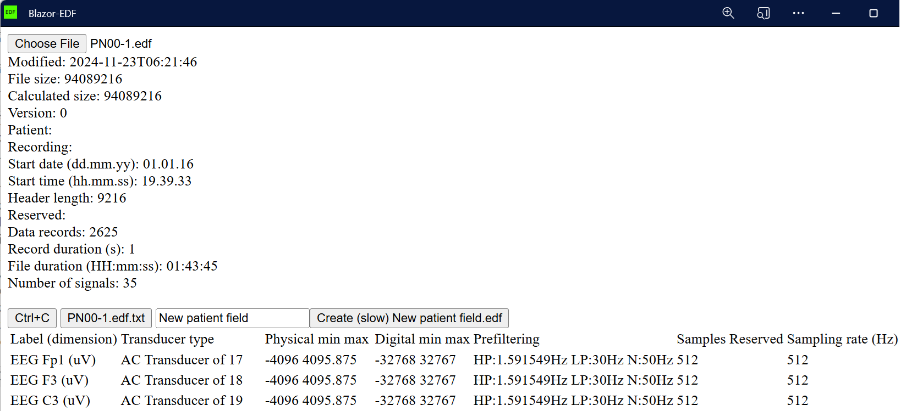
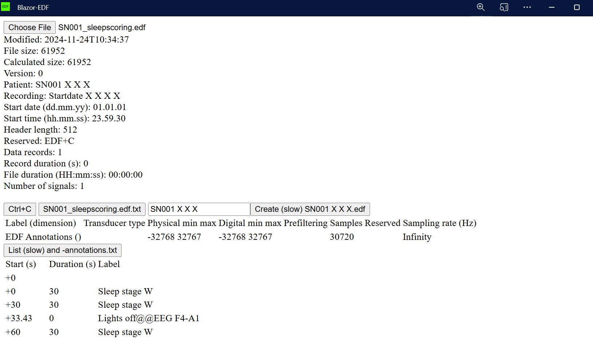

# EDF

v2024-12-03: .NET9 https://blazor.net  WebAssembly (WASM) app to read EDF https://www.edfplus.info and BDF header information.
 Progressive web app (PWA) for offline use in desktop or mobile browser. File is analyzed locally.
App is hosted at https://jussivirkkala.github.io/Blazor-EDF/ and
source code at https://github.com/jussivirkkala/Blazor-EDF</a>. THE SOFTWARE IS PROVIDED "AS IS", WITHOUT WARRANTY OF ANY KIND...

Use Ctrl+F5 to force refresh. Install as PWA by clicking icon in the end of browser address bar.



Select EDF or BDF file e.g. from https://physionet.org/about/database/. Example https://physionet.org/content/siena-scalp-eeg/1.0.0/PN00/PN00-1.edf. 



You can copy header to clipboard or download as ascii [PN00-1.edf.txt](PN00-1.edf.txt). Annotation example https://physionet.org/content/hmc-sleep-staging/1.1/recordings/SN001_sleepscoring.edf.



# Code

There are minimal changes to default Blazor empty template. You can use .NET9 SDK https://dotnet.microsoft.com/ to build and run app: 

```
dotnet watch run
```
Code and UI is in [Pages/Home.razor](Pages/Home.razor). Additional script saveFiles.js  [wwwroot/index.html](wwwroot/index.html) for saving file. 

```
...
<meta name="viewport" content="width=device-width, initial-scale=1.0, maximum-scale=1.0, user-scalable=no, minimum-scale=1, height=device-height, viewport-fit=cover" />
<meta name="mobile-web-app-capable" content="yes" />
<meta name="apple-mobile-web-app-capable" content="yes" />...
...
<script src="saveFile.js"></script>
<script src="saveBinary.js"></script>
<script src="saveStream.js"></script>
<script src="_framework/blazor.webassembly.js"></script>
...
```
In [wwwroot/css/app.css](wwwroot/css/app.css) for mobile layout

```
html {
    overscroll-behavior: none;
    -webkit-user-select: none; /* Safari */
    -ms-user-select: none; /* IE 10 and IE 11 */
    user-select: none; /* Standard syntax */
}

body {
    overflow-y: scroll;
    overscroll-behavior: contain;
}
...
```

</style>
Remove from wwwroot\service_worker.published.js integrity.

```
.map(asset => new Request(asset.url, { integrity: asset.hash, cache: 'no-cache' }));
```
Publish app with:
```
dotnet publish -c release
```
Copy files from bin\Release\net9.0\publish\wwwroot into docs folder. Change correct folder in docs\index.html e.g.
```
<base href="https://jussivirkkala.github.io/Blazor-EDF/" />
``` 

Use \docs option in GitHub pages settings. You need empty .nojekyll file there.

End
